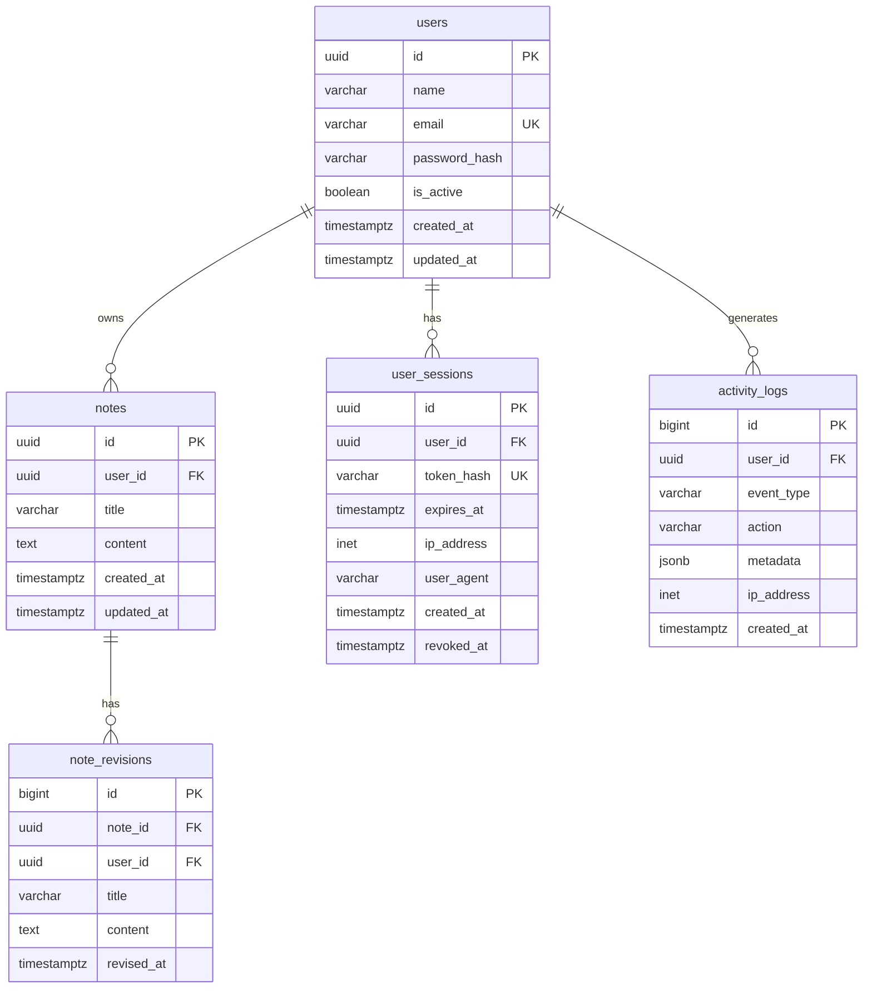

# Notes App — Database Schema

Relational schema for storing **users**, **notes**, **sessions**, **activity logs**, and **note revision history**.

Supports **PostgreSQL** (recommended) and **MySQL**.

## Entity Relationship Diagram



## Tables

| Table | Purpose |
|-------|---------|
| `users` | Account info and hashed passwords |
| `notes` | Rich-text notes linked to one user |
| `user_sessions` | Server-side login sessions / refresh tokens |
| `activity_logs` | Audit trail for user actions and app events |
| `note_revisions` | Optional edit history for notes |

## Key Design Decisions

### Per-user note isolation
- Every note has a required `user_id` foreign key.
- `ON DELETE CASCADE` removes a user's notes when the account is deleted.
- Index on `(user_id, updated_at DESC)` optimizes the main dashboard query.

### Alignment with the React app

| App field | Database column |
|-----------|-----------------|
| `user.id` | `users.id` (UUID) |
| `user.name` | `users.name` |
| `user.email` | `users.email` (unique, lowercase) |
| `note.id` | `notes.id` (UUID) |
| `note.userId` | `notes.user_id` |
| `note.title` | `notes.title` |
| `note.content` | `notes.content` (HTML) |
| `note.createdAt` | `notes.created_at` |
| `note.updatedAt` | `notes.updated_at` |

### Security
- Store **hashed passwords only** (`password_hash`).
- Session tokens stored as **hashes**, not plain values.
- Activity log `metadata` must not contain passwords or tokens.

## Files

| File | Description |
|------|-------------|
| `schema.postgresql.sql` | Full PostgreSQL DDL |
| `schema.mysql.sql` | Full MySQL DDL |
| `seed.sql` | Sample data (PostgreSQL) |

## Setup

### PostgreSQL

```bash
createdb notes_app
psql -U postgres -d notes_app -f database/schema.postgresql.sql
psql -U postgres -d notes_app -f database/seed.sql
```

### MySQL

```bash
mysql -u root -p < database/schema.mysql.sql
```

## Common Queries

### Get all notes for a user (newest first)

```sql
SELECT id, title, content, created_at, updated_at
FROM notes
WHERE user_id = $1
ORDER BY updated_at DESC;
```

### Create a note

```sql
INSERT INTO notes (user_id, title, content)
VALUES ($1, $2, $3)
RETURNING *;
```

### Log user activity

```sql
INSERT INTO activity_logs (user_id, event_type, action, metadata)
VALUES ($1, 'user.activity', 'notes.create', '{"noteId": "..."}');
```

### User note count summary

```sql
SELECT * FROM v_user_note_counts WHERE user_id = $1;
```
